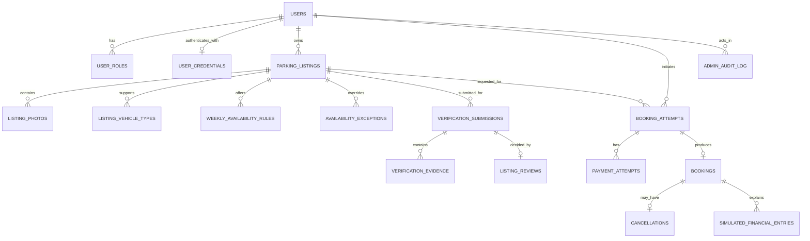

# ParkEasy Database Design

**Version:** 0.2  
**Status:** Approved  
**Date:** 2026-08-16  
**Database:** PostgreSQL  
**Product requirements:** [PRD v0.5](./PRD.md)  
**High-level design:** [HLD v0.2](./HLD.md)  
**Booking design:** [LLD v0.3](./LLD.md)  

## 1. Purpose

This document defines the relational model, ownership, keys, constraints, indexes, deletion behavior, and transaction-sensitive invariants for the ParkEasy MVP.

It is a design document rather than an executable migration. Exact PostgreSQL DDL and Flyway migration history will be produced only after this design is reviewed.

## 2. Design principles

1. PostgreSQL is the source of truth for marketplace and booking state.
2. Database constraints protect invariants that must survive concurrency, application bugs, and future write paths.
3. Foreign keys preserve relationships; historical transactions are not cascade-deleted.
4. A table represents one concept rather than one Java class.
5. Failed commands are retained as attempts without pretending their intended business entity existed.
6. Mutable current configuration does not rewrite historical outcomes.
7. Monetary values and timestamps have explicit semantics.
8. Indexes require a query or constraint justification.
9. Denormalization requires measured benefit and a consistency plan.
10. Sensitive evidence and exact location data are minimized and access-controlled.

## 3. Identifier strategy

The approved MVP design uses PostgreSQL-native `UUID` primary keys for externally referenceable entities.

Benefits:

- identifiers can be generated without first obtaining a database sequence value;
- public identifiers do not reveal simple row counts; and
- one identifier can be used consistently across API and persistence boundaries.

Costs:

- UUID keys and indexes are larger than `BIGINT` keys;
- randomly generated values may have worse index locality; and
- UUIDs do not replace authorization checks.

PostgreSQL generates UUIDv7 identifiers by default using its native `uuidv7()` function. Inserts that need the generated identifier use `RETURNING`. UUIDv7 was selected over UUIDv4 for its time-ordered index locality while retaining decentralized, non-sequential public identifiers. Explicit business timestamps remain authoritative; UUID time information does not replace `created_at`.

Switching to compact internal `BIGINT` keys plus separate public UUIDs remains an alternative if measurements or operational requirements later justify the additional columns and indexes.

## 4. Naming and type conventions

- Table and column names use `snake_case`.
- Primary keys use `<entity>_id` rather than a context-free `id` in documentation and migrations.
- Foreign-key columns use the referenced role where useful, such as `driver_user_id` or `owner_user_id`.
- Business timestamps use `timestamp with time zone` and represent instants.
- Recurring weekly schedules use local time plus an explicit IANA timezone owned by the listing.
- Monetary amounts use integer minor units plus a three-letter currency code; binary floating point is forbidden.
- Mutable rows include creation and update timestamps where operationally useful.
- Status values must be constrained to known values. The choice between lookup tables and text plus `CHECK` constraints will be made per lifecycle; PostgreSQL enums are not assumed.
- User-facing ordering never relies on physical row order.

## 5. High-level entity relationship model



## 6. Accounts and access tables

### 6.1 `users`

Purpose: stable identity and operational account status shared by drivers, owners, and administrators.

Important columns:

- `user_id` — primary key;
- `email_normalized` — unique when email is the sign-in identity;
- phone identity is deferred until a verified product and authentication requirement exists;
- `display_name`;
- `account_status` — active, suspended, or closed;
- `created_at`; and
- `updated_at`.

Constraints:

- normalized sign-in identities are unique;
- account status is constrained to approved values; and
- normal product operations do not delete referenced users.

Email is the mandatory sign-in identity for the browser MVP. Email values are normalized by the application and protected by database normalization and uniqueness constraints.

### 6.2 `user_credentials`

Purpose: isolate locally stored authentication credentials from general profile data.

Important columns:

- `user_id` — primary key and foreign key to `users`;
- `password_hash` when local passwords are used;
- credential update timestamp; and
- security metadata justified by the authentication design.

Passwords are never stored. The MVP stores only a modern encoded password hash in this table and uses server-side session-cookie authentication. If an external identity provider is selected later, this table may be supplemented by an `external_identities` table.

### 6.3 `user_roles`

Purpose: allow one user to act as both driver and owner while protecting administrator privileges.

Important columns:

- `user_id` — foreign key to `users`;
- `role_code` — driver, owner, or administrator; and
- `granted_at` and optional granting actor metadata.

Primary or unique key:

```text
(user_id, role_code)
```

Deleting one role must not delete the user or historical activity performed under that role.

## 7. Listing and verification tables

### 7.1 `parking_listings`

Purpose: one independently bookable physical parking space.

Important columns:

- `listing_id` — primary key;
- `owner_user_id` — foreign key to `users`;
- `listing_status` — draft, pending review, approved, rejected, paused, or suspended;
- title and description;
- exact address fields;
- locality and postal code;
- latitude and longitude when geocoding is available;
- IANA timezone, initially expected to be `Asia/Kolkata`;
- covered/uncovered indicator;
- size or dimension constraints;
- access instructions;
- hourly price in minor units;
- optional daily price in minor units;
- currency code;
- approved-at and status-change metadata;
- created and updated timestamps; and
- version for optimistic update protection if selected.

Constraints:

- each listing has exactly one owner;
- an owner may have many listings;
- prices are non-negative and currency is present;
- latitude and longitude, when present, are within valid numeric ranges;
- one listing represents one space in the MVP; and
- exact address must not be returned merely because the row is queryable.

The owner ID is not unique because one owner may list several spaces.

### 7.2 `listing_photos`

Purpose: ordered metadata for listing images stored outside the relational database.

Important columns:

- `listing_photo_id` — primary key;
- `listing_id` — foreign key;
- object-storage key or controlled media reference;
- display order;
- media status; and
- created timestamp.

Unique key:

```text
(listing_id, display_order)
```

Image bytes should not be placed in the main PostgreSQL tables without a demonstrated reason.

### 7.3 `listing_vehicle_types`

Purpose: normalized many-to-many support for approved vehicle categories.

Important columns:

- `listing_id` — foreign key; and
- `vehicle_type_code` — foreign key to a small controlled lookup or constrained code set.

Primary or unique key:

```text
(listing_id, vehicle_type_code)
```

Exact dimensions may remain on the listing even when category codes are used.

### 7.4 `verification_submissions`

Purpose: retain each owner-verification submission and its lifecycle without overwriting earlier decisions.

Important columns:

- `verification_submission_id` — primary key;
- `listing_id` — foreign key;
- `submitted_by_user_id` — foreign key;
- submission status;
- submitted timestamp; and
- resolved timestamp when applicable.

A listing may have multiple submissions over time after rejection or sensitive edits.

### 7.5 `verification_evidence`

Purpose: metadata for protected evidence associated with a verification submission.

Important columns:

- `verification_evidence_id` — primary key;
- `verification_submission_id` — foreign key;
- evidence type;
- protected object reference;
- content checksum and safe media metadata where justified;
- created timestamp; and
- retention or deletion timestamp.

Evidence bytes should use protected object storage. Public listing-media access must not expose evidence objects.

### 7.6 `listing_reviews`

Purpose: one recorded administrative decision for a submitted review version.

Important columns:

- `listing_review_id` — primary key;
- `verification_submission_id` — unique foreign key;
- `reviewer_user_id` — foreign key to `users`;
- decision;
- reason code and notes;
- decided timestamp; and
- audit correlation identifier.

The unique submission foreign key prevents two final decisions for the same submission. A correction should be an explicit audited operation, not a silent overwrite.

## 8. Availability tables

### 8.1 `weekly_availability_rules`

Purpose: owner-defined recurring local-time intervals during which a listing may be booked.

Important columns:

- `weekly_rule_id` — primary key;
- `listing_id` — foreign key;
- `day_of_week` — constrained numeric or controlled code;
- `start_local_time`;
- `end_local_time`; and
- created and updated timestamps.

Initial constraints:

- start is earlier than end;
- overnight rules are not silently interpreted and must be split or explicitly supported later; and
- exact duplicate rules for one listing are rejected.

Overlapping weekly rules for the same listing should either be rejected or normalized. The exact database enforcement mechanism remains open because local recurring ranges are not simple timestamp ranges.

### 8.2 `availability_exceptions`

Purpose: date-specific closures or additional offered periods that override the recurring schedule.

Important columns:

- `availability_exception_id` — primary key;
- `listing_id` — foreign key;
- exception type — unavailable or additionally available;
- exact start and end instants, or a full-day representation derived under the listing timezone;
- reason visible to the owner; and
- created timestamp.

Precedence is:

1. date-specific unavailable intervals remove supply;
2. date-specific additional availability adds supply where product policy permits it; and
3. otherwise the recurring weekly schedule applies.

Contradictory overlapping exceptions require a validation rule before migration design.

## 9. Booking and idempotency tables

### 9.1 `booking_attempts`

Purpose: durable history and idempotency ownership for each logical create-booking command.

Important columns:

- `booking_attempt_id` — primary key;
- `driver_user_id` — foreign key to `users`;
- `listing_id` — foreign key to `parking_listings`;
- requested arrival and departure instants;
- `idempotency_key`;
- `request_fingerprint`;
- attempt status — processing, succeeded, or failed;
- failure category and safe reason;
- created and completed timestamps; and
- authoritative quote reference or quoted inputs required to explain the attempt.

Critical unique constraint:

```text
UNIQUE (driver_user_id, idempotency_key)
```

Behavior:

- same key and fingerprint returns the recorded logical result;
- same key with a different fingerprint is rejected;
- the database uniqueness constraint arbitrates simultaneous claims; and
- attempts are retained under an explicit retention policy rather than deleted ad hoc.

Indexes:

- the unique idempotency index;
- driver plus creation time for support/history if the query is required; and
- listing plus requested arrival for operational investigation if measurements justify it.

### 9.2 `payment_attempts`

Purpose: one execution of the internal payment simulator for a booking attempt.

Important columns:

- `payment_attempt_id` — primary key;
- `booking_attempt_id` — foreign key;
- sequence number;
- amount in minor units and currency;
- simulator scenario;
- outcome — succeeded or failed;
- failure category; and
- created and completed timestamps.

Unique constraint:

```text
UNIQUE (booking_attempt_id, sequence_number)
```

The MVP application permits one payment attempt per booking attempt. The relational model permits an explicit future retry sequence without treating multiple attempts as multiple bookings.

A separate `payments` table is deferred until a logical real-payment lifecycle exists independently of operational attempts.

### 9.3 `bookings`

Purpose: confirmed reservations only.

Important columns:

- `booking_id` — primary key;
- `booking_attempt_id` — unique foreign key to `booking_attempts`;
- `driver_user_id` — foreign key to `users`;
- `listing_id` — foreign key to `parking_listings`;
- arrival and departure instants;
- applied turnover buffer duration;
- database-generated blocked interval derived from arrival, departure, and the applied buffer;
- agreed price in minor units and currency;
- booking status — confirmed or cancelled;
- confirmed timestamp;
- created and updated timestamps; and
- version if optimistic update protection is selected.

Critical constraints:

- `booking_attempt_id` is unique, so one attempt produces at most one booking;
- arrival is before departure;
- applied buffer is non-negative and is 10 minutes under the provisional MVP rule;
- blocked interval equals the purchased interval extended by the snapshotted buffer;
- price is non-negative and currency is present;
- driver and listing references are retained; and
- confirmed blocked intervals for the same listing cannot overlap.

`driver_user_id` and `listing_id` intentionally appear on both the attempt and booking because booking queries and the exclusion constraint require them on the long-lived reservation row. The migration design must either enforce that they match the successful attempt through a composite reference or document and test the transaction-level consistency rule. This is an explicit normalization tradeoff, not accidental duplication.

Recommended indexes:

- unique index on `booking_attempt_id`;
- driver plus confirmed time for booking history;
- listing plus arrival time for owner history and investigation;
- status-sensitive operational indexes only when supported by actual queries; and
- the GiST index created by the exclusion constraint.

### 9.4 Proposed non-overlap exclusion constraint

Conceptually, PostgreSQL must reject two rows when:

- their `listing_id` values are equal;
- their blocked time ranges overlap; and
- both rows are confirmed.

The intended shape is:

```sql
EXCLUDE USING gist (
    listing_id WITH =,
    blocked_interval WITH &&
)
WHERE (booking_status = 'CONFIRMED')
```

The migration will likely require `btree_gist` to combine scalar equality with range overlap. Purchased and blocked intervals use half-open bounds `[start, end)`, so a new booking beginning exactly at `blocked_until` is allowed.

The authoritative values are:

- `arrival_at` as `timestamp with time zone`;
- `departure_at` as `timestamp with time zone`; and
- the snapshotted turnover-buffer duration.

PostgreSQL derives a stored/generated half-open `tstzrange` equivalent to:

```text
[arrival_at, departure_at + applied turnover buffer)
```

The generated range is used by the exclusion constraint and overlap queries. Application code must not independently write it. This preserves convenient scalar timestamps for cancellation and display while preventing the blocked range from drifting from its authoritative inputs.

The exact generated-column expression and extension support must still be proven in an executable migration experiment before approval.

Official PostgreSQL references:

- <https://www.postgresql.org/docs/current/rangetypes.html>
- <https://www.postgresql.org/docs/current/ddl-constraints.html>

### 9.5 `cancellations`

Purpose: one immutable cancellation explanation and policy outcome for a booking.

Important columns:

- `cancellation_id` — primary key;
- `booking_id` — unique foreign key to `bookings`;
- actor type — driver, owner, or administrator;
- actor user ID when applicable;
- reason code and notes;
- policy rule identifier or version;
- cancellation timestamp;
- simulated refund, cancellation fee, driver compensation, and owner penalty amounts as applicable;
- administrative waiver actor and reason when applicable; and
- replacement-search outcome metadata.

The unique booking foreign key guarantees at most one cancellation. The booking remains in `bookings` with status `CANCELLED`; it is not moved or deleted.

## 10. Simulated financial records

### 10.1 `simulated_financial_entries`

Purpose: append-only, explicitly simulated accounting outcomes linked to a booking.

Important columns:

- `simulated_financial_entry_id` — primary key;
- `booking_id` — foreign key;
- optional cancellation or payment-attempt reference;
- entry type — charge, refund, cancellation fee, driver credit, owner penalty, owner recovery, commission, or platform loss;
- affected party type and identifier when applicable;
- amount in minor units and currency;
- policy or source reference;
- created timestamp; and
- reversal reference if correction is required.

Rules:

- entries are marked simulated by the table boundary and product presentation;
- values never imply that money moved;
- corrections append reversing or compensating entries rather than silently rewriting history; and
- balances and exposure are derived from entries unless a measured need justifies maintained summaries.

This is ledger-like modeling for learning and traceability, not a claim that the MVP implements a regulated payment ledger.

## 11. Administration and audit

### 11.1 `admin_audit_log`

Purpose: append-only record of privileged decisions and state changes.

Important columns:

- `admin_audit_id` — primary key;
- `actor_user_id` — foreign key to `users`;
- action code;
- target type and target identifier;
- reason code and notes;
- correlation identifier;
- safe before/after summary where appropriate; and
- occurred timestamp.

Polymorphic target identifiers cannot receive a normal foreign key to every possible target. Critical domain decisions therefore also belong in their domain tables, such as `listing_reviews` and `cancellations`; the generic audit log supplements rather than replaces relational integrity.

## 12. Foreign-key deletion behavior

Default policy:

```text
Users                RESTRICT deletion when referenced
Parking listings     RESTRICT deletion when referenced
Booking attempts     RESTRICT deletion when referenced
Bookings             RESTRICT deletion when referenced
Cancellations         Never cascade-delete transaction history
Financial entries    Never cascade-delete transaction history
Audit records         Never cascade-delete through product operations
```

Operational removal uses status transitions:

- user → suspended or closed;
- listing → paused, suspended, or archived;
- booking → cancelled under policy; and
- verification evidence → removed only under a deliberate retention process while preserving non-sensitive decision metadata.

Privacy obligations may later require anonymization or deletion of personal fields. That process must preserve referential integrity and the minimum lawful operational record; it must not be implemented as uncontrolled cascading deletion.

## 13. Booking transaction design

### 13.1 Create booking

Proposed MVP ordering:

1. Begin transaction.
2. Claim or resolve `(driver_user_id, idempotency_key)`.
3. Lock the target `parking_listings` row using a pessimistic row lock.
4. Revalidate listing status, owner schedule, date exceptions, price, and requested interval.
5. Query confirmed bookings for an overlapping blocked interval.
6. Execute the internal deterministic payment simulation; no external network call occurs.
7. On simulated success, insert the confirmed booking and simulated financial entries.
8. Mark the booking attempt succeeded and commit.
9. On expected failure, persist the explainable terminal attempt outcome under a deliberately tested transaction path.

The listing lock serializes cooperating booking transactions for one listing. After waiting, a transaction must recheck overlap; a pre-lock result is not trustworthy.

The exclusion constraint remains the final invariant. If the application lock protocol is bypassed or contains a bug, the database must still reject an overlap.

### 13.2 Tradeoffs of listing-row locking

Benefits:

- easy-to-explain ordering for one physical space;
- deterministic overlap recheck;
- works across backend threads and application instances; and
- useful for learning pessimistic locking directly.

Costs:

- all booking creation for one listing waits, even for non-overlapping intervals;
- waiting transactions occupy database connections;
- long transactions increase contention;
- multiple-resource operations could introduce deadlocks if lock order is inconsistent; and
- the lock must never be held across a real external payment call.

The lock will be benchmarked and may later be removed while retaining the exclusion constraint if evidence shows unnecessary contention.

### 13.3 Cancel booking

The cancellation transaction must:

1. lock or otherwise protect the target booking from competing transition;
2. confirm that its status is `CONFIRMED`;
3. evaluate time and actor policy using a supplied decision time;
4. insert exactly one cancellation;
5. set booking status to `CANCELLED`;
6. append required simulated financial outcomes and owner strike information; and
7. commit before attempting replacement discovery.

Once committed, the cancelled booking is excluded from the active non-overlap constraint and its interval becomes available again.

## 14. Isolation and concurrency plan

The initial transaction-isolation choice remains PostgreSQL's normal read-committed behavior plus explicit locks and constraints, subject to migration experiments and integration tests.

Why not assume `SERIALIZABLE` immediately:

- it can abort transactions that must then be retried correctly;
- it does not remove the need to understand database constraints;
- every transaction must be designed for serialization failures; and
- the targeted listing lock and exclusion invariant are more explicit for the MVP use case.

The project should later implement and benchmark alternatives rather than treating any isolation level as magic.

Required concurrent database tests:

- same idempotency key submitted simultaneously;
- different keys for identical intervals;
- partially overlapping intervals;
- non-overlapping intervals on the same listing;
- bookings on different listings;
- booking competing with cancellation;
- exact turnover-buffer boundaries; and
- lock timeout or transaction retry behavior.

## 15. Index plan

Every initial index maps to a constraint or expected query:

| Table | Index | Reason |
|---|---|---|
| `users` | unique normalized sign-in identity | Authentication lookup and uniqueness |
| `user_roles` | unique `(user_id, role_code)` | Membership integrity |
| `parking_listings` | `(owner_user_id, listing_status)` | Owner listing management |
| `parking_listings` | approved/active locality search candidate | Required search path; exact form follows query design |
| `weekly_availability_rules` | `(listing_id, day_of_week)` | Schedule evaluation |
| `availability_exceptions` | listing plus interval/date | Exception evaluation |
| `booking_attempts` | unique `(driver_user_id, idempotency_key)` | Idempotency correctness |
| `payment_attempts` | unique `(booking_attempt_id, sequence_number)` | Attempt ordering integrity |
| `bookings` | unique `booking_attempt_id` | At most one booking per attempt |
| `bookings` | GiST exclusion index | Confirmed non-overlap |
| `bookings` | `(driver_user_id, confirmed_at)` | Driver booking history |
| `bookings` | `(listing_id, arrival_at)` | Owner history and operational lookup |
| `cancellations` | unique `booking_id` | At most one cancellation |
| `simulated_financial_entries` | `(booking_id, created_at)` | Explain one booking's outcomes |

Search indexes will be finalized only after the SQL query shape and `EXPLAIN` plan are available. “Add an index to every foreign key” is not used as an unexamined rule; each write cost and read benefit must be understood.

## 16. Migration strategy

- Flyway is the provisional migration tool because schema history must be versioned and repeatable.
- Migrations are append-only after shared use; an applied migration is not silently rewritten.
- Extensions such as `btree_gist` are created explicitly in migrations and deployment prerequisites.
- Constraints are named for understandable production errors.
- Destructive migrations require a staged compatibility and recovery plan.
- Seed or reference data is separated from personal or production-like test data.
- Testcontainers applies the same migrations used by the application.

The migration tool choice must be confirmed during repository foundation work rather than added invisibly by code generation.

## 17. Data retention and privacy questions

The database cannot be finalized without policy decisions for:

- failed booking-attempt retention;
- idempotency-key retention;
- verification-evidence retention;
- closed-account anonymization;
- exact-address access and retention;
- admin audit retention; and
- simulated financial-record retention.

The MVP must not claim indefinite retention by accident. Concrete periods require product, operational, and legal review.

## 18. Alternatives considered

### 18.1 Store booking IDs in the user row

**Rejected.** One user has many bookings. The foreign key belongs on the many side: booking or booking attempt references the user.

### 18.2 Use owner ID as the listing's unique identity

**Rejected.** One owner may have multiple spaces. Each listing has its own primary key and a non-unique owner foreign key.

### 18.3 Move cancelled bookings to a cancellation table

**Rejected.** It breaks stable identity, complicates references and queries, and creates a risky delete-plus-insert transition. The booking remains and receives one related cancellation record.

### 18.4 Application-only overlap check

**Rejected.** Concurrent transactions can both observe no conflict and insert. The database exclusion constraint is the final guard.

### 18.5 Cache-based idempotency

**Rejected as the correctness mechanism.** Expiry, eviction, or cache failure could permit duplicate execution. PostgreSQL owns the unique idempotency claim.

### 18.6 Global buffer recalculated for historical bookings

**Rejected.** A later configuration change could create conflicts among existing confirmed bookings. Each booking snapshots its applied buffer.

### 18.7 Cascade deletion of transaction history

**Rejected.** Deactivating a user or listing must not erase booking, cancellation, financial, or audit evidence.

## 19. Open decisions for v0.2

1. Decide how duplicated attempt/booking driver and listing references are constrained.
2. Validate the exact generated `tstzrange` expression in an executable PostgreSQL migration experiment.
3. Validate the approved lock-plus-exclusion combination with a working PostgreSQL concurrency experiment.
4. Decide exact pricing columns after hourly and daily rules are approved.
5. Define availability-exception conflict and precedence rules.
6. Select authentication identity fields and credential model.
7. Define evidence storage and retention.
8. Define idempotency and failed-attempt retention.
9. Decide whether simulated financial entries are necessary for the first vertical slice or introduced with cancellation.
10. Define owner-strike persistence after escalation policy is approved.
11. Validate initial indexes using real query plans and representative data.

## 20. Review questions

The engineer should be able to explain:

- why foreign keys usually appear on the many side;
- why owner ID cannot uniquely identify a listing;
- why a failed attempt is not a booking;
- why a booking remains after cancellation;
- why one payment may eventually have multiple attempts;
- how the idempotency unique constraint resolves simultaneous duplicate requests;
- why an application overlap check is insufficient;
- what the listing-row lock serializes;
- why the exclusion constraint remains necessary;
- why a buffer is snapshotted;
- why historical records do not cascade-delete; and
- which indexes exist for correctness versus query performance.

## 21. Approval record

The following relational decisions were developed with the product owner on 2026-08-16:

- foreign keys from booking-side records to users and listings;
- independent listing identity with a non-unique owner reference;
- separate booking, booking-attempt, payment-attempt, and cancellation concepts;
- unique attempt-to-booking and booking-to-cancellation relationships;
- PostgreSQL-backed idempotency; and
- retention of historical transactions after user or listing deactivation.

The product owner selected authoritative scalar arrival/departure/buffer columns plus a database-generated half-open `tstzrange` for overlap enforcement on 2026-08-16.

The product owner approved native PostgreSQL UUID primary keys and the application pre-check plus listing-row lock plus PostgreSQL exclusion-constraint strategy on 2026-08-16.

On 2026-08-24, the product owner approved PostgreSQL-generated UUIDv7 identifiers, mandatory normalized email identity for the browser MVP, separate local credentials, multi-role membership, default `DRIVER` registration, `OWNER` assignment when owner onboarding begins, and protected internal-only `ADMIN` assignment.

Database design v0.2 was reviewed and approved by the product owner on 2026-08-16. Items in Section 19 remain implementation experiments or later product-policy decisions rather than objections to the approved direction.
