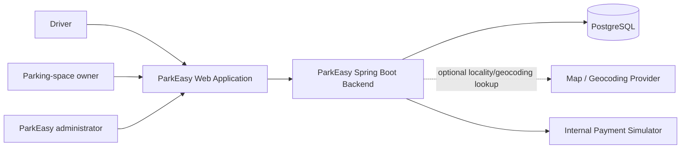
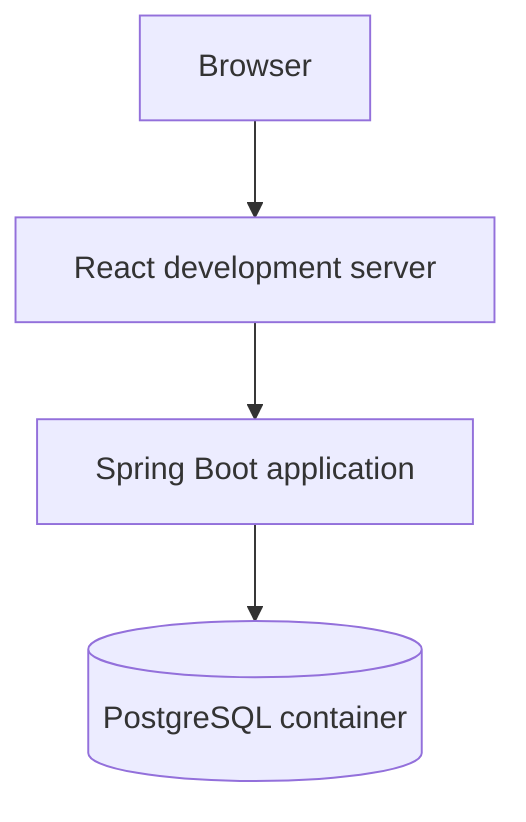
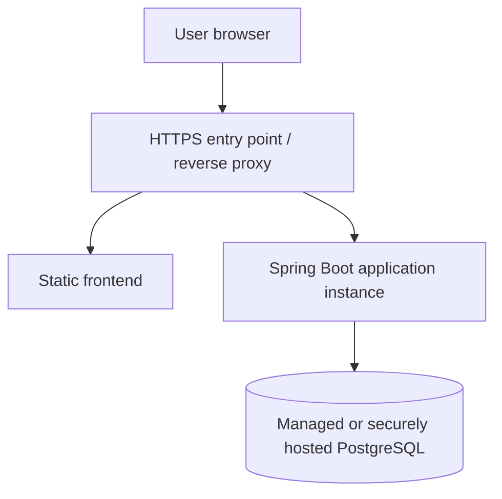
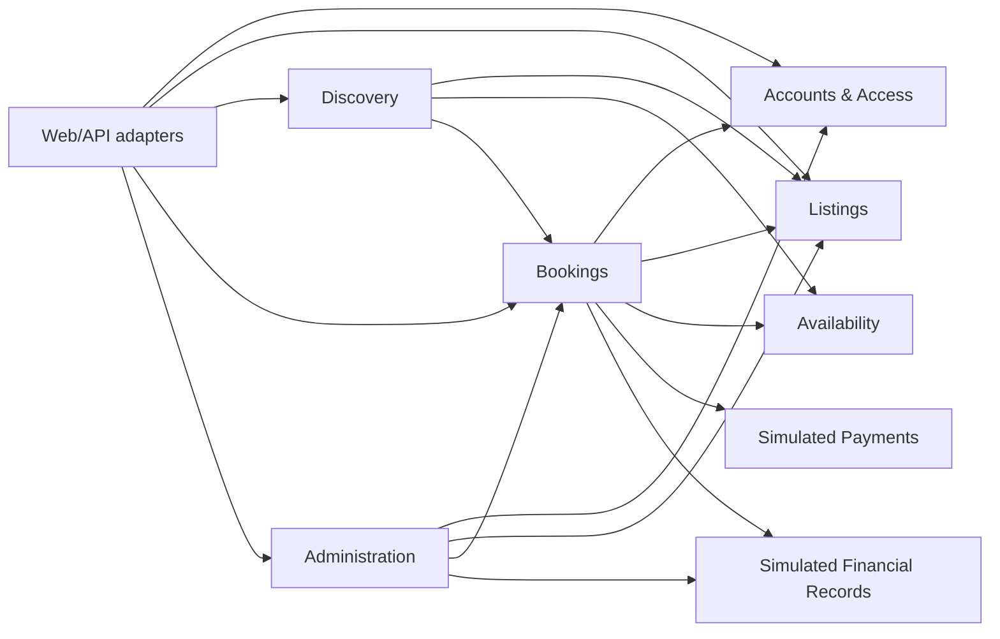
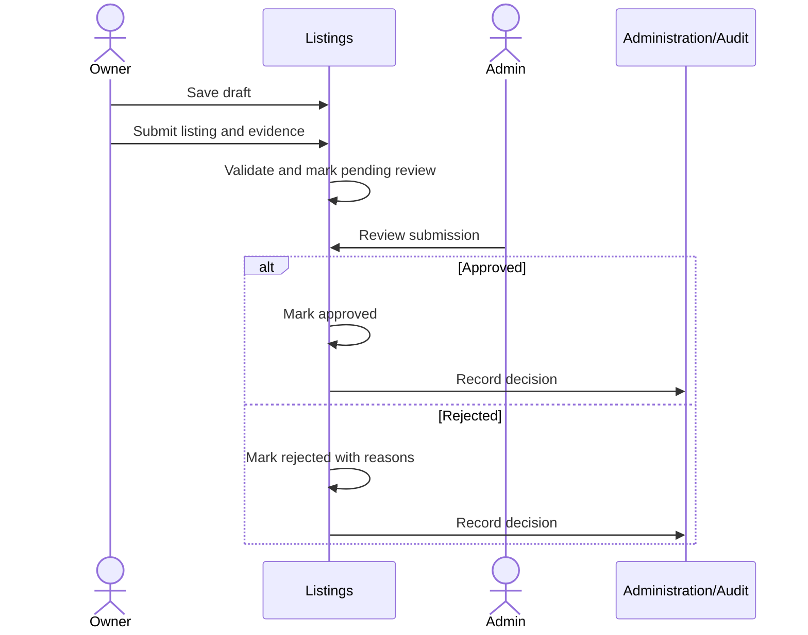
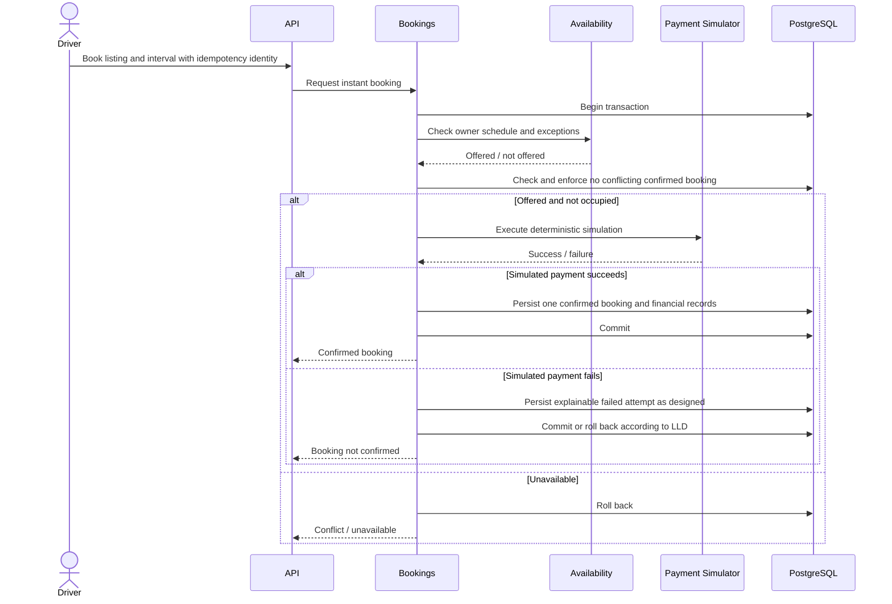

# ParkEasy High-Level Design

**Version:** 0.3  
**Status:** Approved  
**Date:** 2026-08-15  
**Product requirements:** [PRD v0.3](./PRD.md)  

## 1. Purpose

This document defines the proposed system-level architecture for the ParkEasy MVP. It describes deployable components, internal module boundaries, communication paths, data ownership, major workflows, reliability expectations, and an evidence-based evolution path.

It does not define Java classes, database columns, SQL migrations, or REST endpoint payloads. Those belong in the LLD, database design, and API specification after this HLD is reviewed.

## 2. Architectural drivers

The design is driven by the following requirements, in priority order:

1. **Booking correctness:** one parking space must never have overlapping confirmed bookings.
2. **Understandability:** one developer must be able to run, debug, test, and explain the complete system.
3. **Fast product iteration:** requirements will change after field interviews and pilot feedback.
4. **Clear domain boundaries:** features must not collapse into one undifferentiated controller-service-repository codebase.
5. **Security and traceability:** identity, authorization, owner verification, bookings, simulated money, and admin actions require controlled access and history.
6. **Deployability:** the MVP must run locally with repeatable infrastructure and later support a controlled cloud pilot.
7. **Measurability:** latency, errors, booking conflicts, query behavior, and simulated financial exposure must be observable.
8. **Evolution:** later payment, caching, messaging, and service extraction must be possible without paying their operational cost today.

## 3. Architecture decision

ParkEasy will begin as a **modular monolith**:

- one Spring Boot backend deployable;
- one PostgreSQL database;
- one React/TypeScript web frontend;
- feature-oriented backend modules with explicit public contracts;
- an internal simulated-payment adapter;
- no Redis, Kafka, external payment gateway, or microservices in the MVP; and
- Docker Compose for reproducible local infrastructure.

### 3.1 Boundary rule

> A module may use another module only through that module's public application contract. It must not access the other module's repositories, internal domain objects, or owned database structures directly.

The physical enforcement mechanism will be selected during LLD. Package structure is necessary but not sufficient; automated architecture tests should detect forbidden dependencies.

### 3.2 Why a modular monolith

For one developer and an unvalidated marketplace, separate services would add network calls, partial failures, service discovery, distributed tracing, deployment coordination, API versioning, and cross-service consistency before ParkEasy has the traffic or team structure that justifies them.

A modular monolith preserves code ownership boundaries while allowing important MVP operations to use local calls and PostgreSQL transactions. It can still be deployed as multiple identical application instances when horizontal scaling becomes justified.

## 4. System context

The payment simulator is a backend adapter inside the same deployable application, not an external system. The map/geocoding provider is optional until Near me or coordinate-based distance is included.

## 5. Deployment view

### 5.1 Local development

The local environment should be reproducible through documented commands. PostgreSQL should run in a container; the backend and frontend may run from their development tools for fast feedback. Containerizing application processes is added when the basic development loop is understood.

### 5.2 Initial pilot

The first pilot may use one application instance. That is an accepted availability limitation, not a claim that the system has no single point of failure. Before wider production use, multiple stateless backend instances may sit behind a load balancer while PostgreSQL receives its own backup and availability plan.

The exact AWS topology will be decided in the cloud phase using measured traffic, operational needs, and cost—not resume keywords.

## 6. Logical backend modules

### 6.1 Module map

Arrows mean use of an explicitly exposed application contract, not access to implementation details.

### 6.2 Responsibilities and ownership

| Module | Responsibilities | Conceptual data owned |
|---|---|---|
| Accounts & Access | Registration, identity, roles, authentication support, account status | Accounts, credentials or external identities, roles, account status |
| Listings | Parking-space description, suitability, photos metadata, owner relationship, publication lifecycle | Listings, listing features, verification submission references, listing status history |
| Availability | Owner-defined weekly schedules, date exceptions, and evaluation of whether a requested interval is offered | Availability schedules and exceptions |
| Discovery | Locality/time search, filters, result ordering, listing summaries, and aggregation of schedule and occupancy answers | Search-specific query models or projections if later justified |
| Bookings | Booking creation, state transitions, occupied-interval queries, non-overlap enforcement, and cancellation | Booking attempts, bookings, booking price snapshots, cancellation records |
| Simulated Payments | Deterministic simulated success and failure behavior | Payment-attempt records or payment outcomes exposed to the financial-records boundary |
| Simulated Financial Records | Refund, credit, owner penalty, recovery, commission, and platform-exposure records | Immutable simulated financial entries and derived balances |
| Administration | Review queues, approve/reject/suspend workflows, dispute outcomes, privileged-action coordination | Admin cases, decisions, and audit records |

“Owned” means that other modules cannot modify this data through their own repositories. The database schema may still use foreign keys and joins, but cross-module access must follow an explicit design reviewed during database and LLD work.

### 6.3 Module interaction rules

1. Web adapters validate transport-level input and call an application use case; they do not contain domain policy.
2. A module exposes use-case-oriented contracts rather than exposing repositories or generic entity mutation.
3. Cross-module calls are synchronous and in-process for the MVP.
4. A module must not return mutable persistence entities as its public contract.
5. Cross-module DTOs contain only the information required by the caller.
6. Circular module dependencies are forbidden.
7. Domain state changes must occur through the module that owns the state.
8. Internal events may decouple secondary behavior, but they are not a substitute for understanding transaction timing and failure behavior.

## 7. Frontend architecture

The frontend is a React/TypeScript web application. It supports driver, owner, and administrator journeys but remains secondary to backend and systems learning.

Initial frontend areas are:

- account access;
- locality-and-time search;
- listing results and details;
- booking confirmation and history;
- owner listing, availability, and booking management; and
- administrative review queues.

The browser is not trusted to enforce authorization, calculate authoritative prices, or decide availability. Those decisions belong to the backend.

Frontend and backend should use a documented versioned HTTP API. During deployment they should preferably appear under one HTTPS origin to reduce unnecessary cross-origin complexity. The final hosting arrangement will be selected during deployment design.

## 8. Data architecture

### 8.1 PostgreSQL as the source of truth

PostgreSQL is authoritative for:

- users and roles;
- listing and verification state;
- availability definitions;
- bookings and cancellations;
- simulated payment and financial records; and
- administrative audit history.

Redis is not a source of truth and is not part of the MVP. When caching is introduced, PostgreSQL must remain capable of reconstructing correct marketplace state.

### 8.2 Transaction principles

- Booking confirmation requires an atomic database transaction around the state that determines whether a booking can be confirmed.
- Availability displayed during search is advisory; availability must be checked again during booking.
- Confirmed booking non-overlap is a database-backed invariant, not only an in-memory check.
- A request retry must not create an unintended duplicate booking or simulated payment.
- Historical price, cancellation, and simulated financial outcomes must remain explainable after listing prices change.
- Administrative decisions and their audit records must not diverge silently.

The exact PostgreSQL constraint, isolation level, and optimistic or pessimistic locking strategy will be compared in the database design. The HLD intentionally does not select one prematurely.

### 8.3 Simulated financial records

The MVP does not move money, but it models financial outcomes separately:

- booking charge;
- driver refund;
- cancellation fee;
- owner-cancellation compensation credit;
- owner penalty;
- recovered owner penalty;
- illustrative commission; and
- hypothetical ParkEasy-funded loss.

These records must be auditable and distinguish simulated values from real money. The LLD must decide whether they are represented as immutable ledger-like entries or another model after comparing alternatives.

## 9. Major workflows

### 9.1 Listing approval

The later LLD must define how audit recording behaves if part of this operation fails. An admin response must not claim success when the listing and audit outcome disagree.

### 9.2 Search

1. Driver submits locality, arrival, departure, and optional filters.
2. Discovery validates the requested interval.
3. Discovery obtains approved listings, asks Availability whether the owner offers each requested interval, and asks Bookings whether the interval is already occupied.
4. Discovery returns summaries with approximate location and calculated price.
5. Search results do not reserve inventory.

The first implementation should favor correct, explainable SQL over premature caching. Query plans and indexes will be measured using realistic data before optimization.

### 9.3 Instant booking with simulated payment

The sequence is conceptual. It does not decide transaction annotations, repository calls, or exact failure-attempt persistence. Those details must be reasoned through during LLD.

### 9.4 Driver cancellation

1. Bookings loads the confirmed booking and validates the actor.
2. Bookings evaluates the ordered cancellation rules using booking-confirmation time, cancellation time, and arrival time.
3. Bookings records the cancellation and applicable simulated refund or fee outcome.
4. The booking no longer blocks future availability after the cancellation commits.
5. Cancellation history remains immutable through normal product operations.

### 9.5 Owner cancellation and replacement assistance

1. Owner requests cancellation with a reason.
2. Bookings records the cancellation, full simulated driver refund, strike, and owner penalty unless an authorized waiver applies.
3. Discovery searches for currently available alternatives matching time and vehicle suitability.
4. The driver receives options and chooses whether to create a new booking.
5. The system records simulated driver credit and owner-recovery exposure separately.
6. Repeated strikes make the listing eligible for pause and administrative review.

Replacement search failure must not prevent the original cancellation and refund record from completing. This secondary behavior may later become asynchronous, but messaging is not justified for the MVP.

## 10. API and communication style

- Browser-to-backend communication uses HTTPS and JSON-based REST APIs.
- Resource-oriented endpoints are combined with explicit workflow operations where a state transition is more important than CRUD semantics.
- APIs return clear client, authorization, conflict, and server-error outcomes.
- List endpoints use bounded pagination.
- Booking creation accepts a client-provided idempotency identity under rules defined in the API specification.
- Date-time values use unambiguous instants and an explicitly defined business timezone where local schedule interpretation is required.
- API contracts are documented before frontend integration.

Exact paths, payloads, status codes, validation errors, and versioning policy belong in `API.md`.

## 11. Security architecture

### 11.1 Trust boundaries

- Browser input is untrusted.
- The backend is the authorization and business-policy enforcement boundary.
- Uploaded verification evidence is sensitive and must not be served as ordinary public listing media.
- Administrator capabilities are privileged and auditable.
- The simulated payment interface must reject real financial credentials.

### 11.2 Authentication decision

The first-party browser MVP uses a server-side authenticated session carried by a secure cookie:

- the cookie is `HttpOnly`, `Secure` in deployed environments, and assigned an appropriate `SameSite` policy;
- the server derives user identity from the authenticated security context rather than request-body user IDs;
- state-changing requests require CSRF protection;
- frontend and backend use one origin where practical;
- initial single-instance session storage is an accepted development/pilot limitation; and
- shared session storage is introduced before multiple backend instances require it.

JWT bearer authentication is deferred until a mobile client, external API consumer, delegated identity provider, or service boundary creates a concrete requirement. This does not prevent later OAuth 2.0/OpenID Connect integration.

### 11.3 Initial controls

- secure authentication mechanism selected during LLD;
- server-side role and ownership checks;
- modern password hashing if ParkEasy stores passwords;
- request validation and safe error responses;
- parameterized persistence access;
- least-privilege database and deployment credentials;
- HTTPS in deployed environments;
- restricted verification-document access;
- audit records for admin decisions; and
- secrets supplied through environment-specific secure configuration rather than source control.

Threat modelling and detailed controls will be maintained in `SECURITY.md` before public deployment.

## 12. Reliability and failure strategy

| Failure | Required MVP behavior |
|---|---|
| PostgreSQL unavailable | Reject operations clearly; never fabricate booking success. |
| Concurrent booking attempts | At most one conflicting interval may become confirmed. |
| Duplicate client submission | Return or converge on the original logical outcome without duplicate confirmation. |
| Simulated payment failure | Do not confirm the booking or permanently consume availability. |
| Application stops before commit | No uncommitted confirmation is visible after restart. |
| Application stops after commit but before response | A retry can discover the committed outcome through idempotency handling. |
| Optional geocoding unavailable | Locality search remains usable when possible; Near me may degrade clearly. |
| Replacement search returns nothing | Preserve refund and cancellation outcome; report that no replacement is available. |
| Audit-sensitive admin operation fails | Do not report success unless the required state and audit outcome are consistent. |

External gateway, Kafka, cache, and multi-service failure policies are deferred until those components exist.

## 13. Observability

Before a controlled pilot, the backend should provide:

- structured application logs;
- a request correlation identifier;
- health and readiness information;
- request count, error, and latency distributions;
- database connection-pool visibility;
- booking success, conflict, retry, and failure counts;
- listing-review queue age;
- owner cancellation and grace-period cancellation counts; and
- simulated platform-compensation exposure.

Logs must not expose passwords, tokens, verification evidence, or unnecessary personal data. Metrics must distinguish synthetic tests from real-user activity.

The specific logging, metrics, and tracing libraries will be selected during implementation planning.

## 14. Testing strategy at architecture level

The system requires multiple test layers:

- **Unit tests:** domain policies such as availability, pricing, cancellation, and state transitions.
- **Module tests:** public module use cases with internal dependencies controlled.
- **Architecture tests:** forbidden cross-module dependencies and cycles.
- **Repository integration tests:** real PostgreSQL behavior through Testcontainers.
- **API integration tests:** authentication, authorization, validation, and state transitions.
- **Concurrency tests:** simultaneous attempts for the same listing and interval.
- **Failure tests:** duplicate requests, simulated payment failure, and restart-safe persisted outcomes.
- **Performance tests:** measured workloads after functional correctness is established.

Mocking PostgreSQL behavior is not sufficient for transaction, lock, constraint, or query-plan claims.

## 15. Scalability approach

The MVP scales vertically first because that is operationally simple. The application should avoid storing authoritative session or booking state only in process memory, allowing later deployment of multiple backend instances.

Optimizations require evidence:

| Observed problem | Candidate response—not a pre-commitment |
|---|---|
| Repeated expensive reads | Query/index improvement, then measured caching |
| Search workload dominates writes | Read model, search engine, or read scaling after measurement |
| Database connection saturation | Query reduction, pool tuning, workload control, or scale-up |
| Notification work delays requests | Background execution, then durable messaging if delivery guarantees require it |
| One module has independent scale/release needs | Evaluate service extraction using measured coupling and operational benefit |
| High contention on popular listings | Revisit transaction strategy, inventory model, and request admission using benchmarks |

Redis, Kafka, replicas, partitioning, and microservices are outcomes of diagnosed problems, not default milestones.

## 16. Evolution path

### 16.1 Real payment provider

Introduce a gateway adapter in sandbox mode behind the payment contract. This creates external callbacks, ambiguous timeouts, reconciliation, refunds, and security requirements. Booking confirmation policy must be revisited before live money is enabled.

### 16.2 Redis

Introduce Redis only for a measured need such as rate limiting or demonstrably valuable caching. Define behavior when Redis is unavailable and prevent cached availability from becoming booking authority.

### 16.3 Asynchronous processing

Introduce durable messaging when secondary work such as notifications requires independent retries, buffering, or scaling. Before Kafka, document duplicate delivery, ordering, idempotent consumption, retry, and dead-letter behavior.

### 16.4 Service extraction

A module becomes a microservice candidate only when at least one concrete driver exists:

- materially different scaling characteristics;
- independent deployment demanded by team ownership or release frequency;
- fault isolation that can actually be achieved;
- a stable domain boundary and contract;
- security or compliance isolation; or
- evidence that monolith deployment is the limiting constraint.

Extraction also requires accepting network failure, data ownership migration, observability, deployment, and consistency costs.

## 17. Alternatives considered

### 17.1 Microservices from the beginning

**Rejected for MVP.** They provide independent deployment and scaling but solve no demonstrated team or traffic constraint. They would introduce distributed consistency and operational work before core booking behavior is proven.

### 17.2 Unstructured layered monolith

**Rejected.** A global controller/service/repository organization makes feature ownership unclear and encourages cross-domain data manipulation. Package-by-feature modules with explicit contracts provide stronger conceptual boundaries.

### 17.3 Serverless functions for each workflow

**Rejected for MVP.** This would fragment local reasoning, transaction handling, deployment, and observability without a demonstrated burst-scaling or operations benefit.

### 17.4 Redis-backed booking locks as the primary correctness mechanism

**Rejected for MVP.** PostgreSQL owns booking truth. Adding a distributed lock before understanding database concurrency creates another failure mode and does not remove the need for database correctness.

## 18. Architecture risks

| Risk | Response |
|---|---|
| Module boundaries remain merely cosmetic | Define public contracts, forbid cross-module repositories, and add architecture tests. |
| Shared database encourages direct table access | Assign logical ownership and review every cross-module query during database design. |
| Long transactions reduce booking throughput | Keep the critical transaction focused and benchmark contention before optimizing. |
| Search design couples several modules | Start with explicit query contracts and revisit read projections when query evidence exists. |
| Simulated payments hide real provider complexity | Document that real gateways require a new failure and consistency review. |
| One pilot instance is unavailable during failure | Accept and document the pilot limitation; add redundancy before reliability requirements demand it. |
| Premature infrastructure consumes project time | Require a problem statement and measurement before adding each component. |

## 19. Decisions remaining after HLD v0.3

1. How will module boundaries be physically enforced: package visibility, architecture tests, Maven modules, or a justified combination?
2. What exact deployment mechanism will place the frontend and backend under one origin?
3. Is Near me included in the first pilot, and if so, which map/geocoding dependency is acceptable?
4. Where will sensitive owner-verification evidence be stored and how long will it be retained?
5. What notification channel is required for the pilot?
6. What initial pilot availability objective and recovery procedure are realistic?

These decisions should be resolved through focused design exercises rather than guessed during implementation.

## 20. Review checklist

Before approving HLD v0.1, the product owner and engineer should be able to explain:

- why modularity does not require microservices;
- why microservices do not automatically eliminate single points of failure;
- which module owns each major state change;
- why search availability is advisory but booking availability must be rechecked;
- where the non-overlap invariant is ultimately enforced;
- what happens if the application commits a booking but crashes before responding;
- why Redis and Kafka are absent from the MVP; and
- what evidence would justify extracting a service later.

## 21. Approval record

On 2026-08-15, the product owner selected a modular monolith for the MVP because microservice deployment and operational overhead are not yet justified.

The agreed module-boundary principle is that no module may manipulate another module's internals or owned state directly; collaboration must occur through an explicit public contract.

HLD v0.1 was reviewed and approved by the product owner on 2026-08-15.

HLD v0.2 refines availability ownership discovered during booking LLD: Availability owns owner schedules and exceptions; Bookings owns occupied intervals; Discovery combines their read contracts. The product owner approved this refinement with the booking LLD on 2026-08-15.

The product owner approved server-side session-cookie authentication with CSRF protection for the first-party browser MVP on 2026-08-17. JWT is deferred until a concrete client or service-boundary requirement exists.
