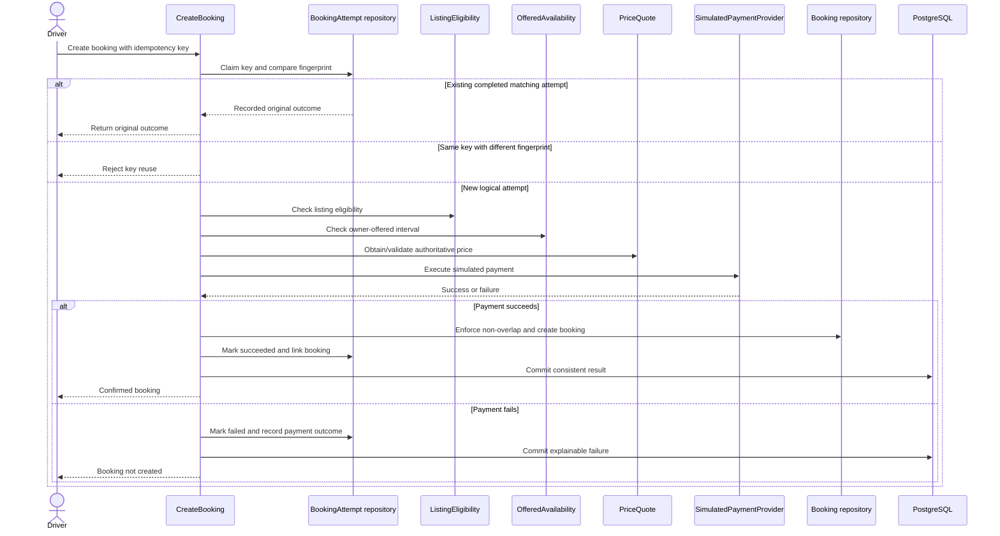

# ParkEasy Low-Level Design

**Version:** 0.4  
**Status:** Approved booking-domain slice  
**Date:** 2026-08-15  
**Product requirements:** [PRD v0.4](./PRD.md)  
**High-level design:** [HLD v0.2](./HLD.md)  

## 1. Scope

This version designs the booking module's domain model, public contracts, state transitions, idempotency behavior, transaction boundaries, and collaboration with Availability and Simulated Payments.

It deliberately does not define JPA annotations, SQL column types, REST payloads, or complete Java implementations. Database constraints will be finalized in `DATABASE.md`; transport details will be finalized in `API.md`.

Later LLD versions will add detailed models for accounts, listings, owner verification, availability authoring, discovery, and administration.

## 2. Design goals

1. Never confirm overlapping bookings for one parking space.
2. Process one logical booking request at most once, even after client retries.
3. Distinguish a failed attempt from a reservation that actually existed.
4. Preserve enough history to explain booking, payment, cancellation, and administrative outcomes.
5. Keep business policy independent of Spring MVC and JPA.
6. Make module ownership and transaction boundaries explicit.
7. Avoid designing external-payment complexity into the internal simulator prematurely.

## 3. Domain language

| Term | Meaning |
|---|---|
| Booking intent | A driver's request to reserve one listing for one interval at the quoted price. |
| Booking attempt | Persistent processing history for one logical booking intent and idempotency identity. |
| Payment attempt | One execution of the simulated payment provider for a booking attempt. |
| Booking | A reservation that was successfully confirmed. Failed attempts are not bookings. |
| Offered interval | An interval permitted by the owner's weekly schedule and date exceptions. |
| Occupied interval | An interval overlapping an existing confirmed, non-cancelled booking. |
| Cancellation | An immutable record explaining who cancelled a booking and which policy outcome applied. |
| Temporal view | Upcoming, in-progress, or ended status calculated from current time rather than persisted as booking state. |

## 4. Module ownership refinement

Availability and occupancy are related but not identical:

- **Availability owns supply intent:** when the owner says a space may be booked.
- **Bookings owns consumed supply:** intervals already occupied by confirmed bookings.
- **Discovery combines read answers:** an interval is searchable only if the listing is approved, the owner offers it, and no booking occupies it.
- **Bookings enforces confirmation:** during booking, it rechecks the offered schedule through Availability and enforces non-overlap against its own authoritative booking data.

This allocation avoids a circular dependency. Availability does not call Bookings, and Bookings does not allow Availability to manipulate reservations.

## 5. Domain model

### 5.1 BookingAttempt

`BookingAttempt` records every logical create-booking command, including failures.

Conceptual attributes:

- attempt identifier;
- driver identifier;
- listing identifier;
- requested interval;
- quoted-price identity or request price snapshot input;
- client idempotency key;
- canonical request fingerprint;
- processing status;
- failure category and safe diagnostic reason, when failed;
- resulting booking identifier, when successful;
- creation and completion timestamps; and
- version or concurrency token if required by the persistence design.

Processing states:

```text
PROCESSING -> SUCCEEDED
PROCESSING -> FAILED
```

`SUCCEEDED` and `FAILED` are terminal for the same logical attempt. A new business attempt requires a new idempotency key.

### 5.2 PaymentAttempt

`PaymentAttempt` records one call to the simulated-payment contract.

Conceptual attributes:

- payment-attempt identifier;
- booking-attempt identifier;
- amount and currency;
- simulator scenario or instruction;
- outcome: `SUCCEEDED` or `FAILED`;
- failure category when applicable; and
- creation and completion timestamps.

The model permits more than one payment attempt per logical booking attempt in the future, but the MVP policy should execute at most one unless an explicit retry rule is later approved.

### 5.3 Booking

`Booking` represents an actual confirmed reservation.

Conceptual attributes:

- booking identifier;
- successful booking-attempt identifier;
- driver identifier;
- listing identifier;
- booking interval;
- immutable price snapshot;
- applied turnover-buffer snapshot;
- persisted state: `CONFIRMED` or `CANCELLED`;
- confirmation timestamp;
- cancellation identifier when cancelled; and
- version or concurrency token if required.

Allowed persisted transition:

```text
CONFIRMED -> CANCELLED
```

`CANCELLED` is terminal through normal product operations. Reinstating a cancelled booking would hide historical truth and potentially conflict with a new reservation; the driver must create a new booking instead.

### 5.4 Cancellation

`Cancellation` records the event and policy outcome separately from the booking's minimal state.

Conceptual attributes:

- cancellation identifier;
- booking identifier;
- actor type: `DRIVER`, `OWNER`, or `ADMIN`;
- actor identifier;
- cancellation timestamp;
- reason or reason code;
- policy rule applied;
- simulated refund amount;
- simulated cancellation fee;
- simulated driver compensation;
- simulated owner penalty;
- administrative waiver identity and reason when applicable; and
- replacement-search outcome when owner-caused.

A booking may have at most one successful cancellation record.

### 5.5 Value objects

The booking domain should use explicit values rather than primitive strings and numbers for important concepts:

- `BookingId`, `BookingAttemptId`, `ListingId`, and `UserId`;
- `BookingInterval` with start and end instants;
- `TurnoverBuffer` used to calculate the blocked interval without changing the purchased interval;
- `Money` with amount and currency;
- `IdempotencyKey`;
- `RequestFingerprint`; and
- `CancellationOutcome`.

The exact Java representation will be chosen during implementation review. Java records may be suitable for immutable value carriers, but only after equality, validation, and persistence behavior are understood.

## 6. Invariants

### 6.1 Booking interval

- Start must be strictly earlier than end.
- Both values must be unambiguous instants.
- Local recurring availability is interpreted using the listing's business timezone.
- The duration and advance-booking limits remain product decisions and must be validated before confirmation.
- Interval-overlap semantics must be defined once and reused everywhere.

Purchased booking intervals use the half-open model `[start, end)`. For conflict detection, the MVP applies a fixed 10-minute turnover buffer after departure:

```text
purchased interval: [start, end)
blocked interval:   [start, end + 10 minutes)
```

A booking ending at 14:00 therefore conflicts with another beginning before 14:10; one beginning exactly at 14:10 is allowed. The customer is charged only for `[start, end)` and is still required to leave at `end`. The buffer is operational protection for the following booking, not permission to overstay.

The global buffer configuration supplies the value for a new booking, but the applied value is snapshotted when that booking is confirmed. Changing the default must not retroactively alter existing blocked intervals. The physical database design may store the applied duration and derive `blocked_until`, or store an equivalently protected representation; it must avoid two independently mutable values that can disagree.

### 6.2 Booking correctness

- A booking can be created only from a successful booking attempt.
- A successful booking attempt references exactly one booking.
- A failed booking attempt references no booking.
- A confirmed, non-cancelled booking blocks overlapping confirmation for the same listing.
- Conflict evaluation uses the blocked interval including the fixed 10-minute post-departure buffer.
- Each booking retains the buffer applied at confirmation; later default changes affect only new bookings.
- Search results and earlier availability checks do not guarantee later confirmation.
- Cancellation can occur at most once.
- After scheduled departure, normal cancellation is forbidden; the dispute workflow applies.

### 6.3 Money

- Monetary values use decimal arithmetic, never binary floating-point.
- Currency is explicit even though the initial market uses INR.
- The booking retains the agreed price snapshot after listing prices change.
- Simulated amounts must be labelled and must never be represented as transferred money.
- Financial records are not physically deleted through normal workflows.

### 6.4 Idempotency

- The same driver, operation, and idempotency key identify one logical booking attempt.
- A canonical fingerprint binds the key to listing, interval, and other material request fields.
- Reuse of the same key with a different fingerprint is rejected.
- Concurrent insertion of the same key is resolved by a PostgreSQL uniqueness guarantee.
- A retry after success returns the original booking outcome.
- A retry after a terminal failure returns the recorded failure unless an explicit retry policy allows a new attempt with a new key.

## 7. Public application contracts

These are responsibility-level contracts, not final Java signatures.

### 7.1 Commands exposed by Bookings

`CreateBooking`

- Input: driver, listing, interval, quoted-price reference/input, idempotency key, payment-simulation instruction.
- Output: confirmed booking result, recorded failure result, in-progress result, or conflict.

`CancelBooking`

- Input: booking, actor, cancellation time, reason.
- Output: cancellation outcome including simulated financial result and whether replacement search is required.

`RecordAdministrativeCancellationWaiver`

- Input: cancellation or case identity, administrator, reason.
- Output: audited adjustment result under permissions defined by Administration.

### 7.2 Queries exposed by Bookings

`GetBooking`

- Returns the booking only when the caller is authorized to see it.

`ListDriverBookings` and `ListOwnerBookings`

- Return bounded, paginated booking summaries through ownership-aware queries.

`CheckOccupiedInterval`

- Input: listing and interval.
- Output: whether a confirmed, non-cancelled booking occupies the interval.
- Used by Discovery for advisory search filtering; it does not reserve the interval.

### 7.3 Contracts consumed by Bookings

`ListingEligibility`

- Confirms that the listing exists, is approved and active, supports the vehicle, and may be booked by the driver.

`OfferedAvailability`

- Confirms that the requested interval fits the owner's schedule and date exceptions.

`PriceQuote`

- Produces or validates the authoritative quoted price under the approved pricing rules.

`SimulatedPaymentProvider`

- Executes deterministic success or failure without accepting real financial credentials.

`SimulatedFinancialRecorder`

- Records payment, refund, fee, credit, penalty, recovery, commission, and platform-exposure outcomes through its owning module.

`ReplacementDiscovery`

- Finds suitable alternatives after an owner-caused cancellation. Failure or absence of alternatives must not roll back the original cancellation.

## 8. Create-booking workflow



This sequence remains conceptual. Calling an internal simulator before the final database write is acceptable only because it has no irreversible external side effect. A real gateway would require a different state machine and reconciliation design.

## 9. Idempotency concurrency behavior

The implementation must not use a Java-level “find then insert” check as the final guard. Two threads can both observe absence.

Required behavior:

1. Claim `(driver, operation, idempotency key)` using a PostgreSQL-backed unique constraint.
2. Bind the claim to a canonical request fingerprint.
3. If another transaction owns the same new claim, wait, conflict, or return processing according to the API contract.
4. After the winner commits, matching retries return its recorded result.
5. If the winner rolls back completely, a later request may claim the key.
6. Persist the attempt outcome and resulting booking consistently so a crash after commit but before HTTP response remains recoverable.

The API specification must define the response for an attempt still processing and the retention period for idempotency records.

## 10. Booking concurrency behavior

Idempotency and booking overlap solve different problems:

- idempotency prevents the same logical request from executing twice;
- non-overlap prevents different requests from reserving the same space and time.

The approved MVP database strategy combines:

- an application pre-check for clear product behavior;
- pessimistic locking of the listing row to serialize cooperating booking transactions for that listing; and
- a PostgreSQL exclusion constraint over the generated blocked range as the final non-overlap invariant.

The transaction uses normal read-committed behavior initially. After a waiting transaction acquires the listing lock, it must recheck overlap. The strategy must be demonstrated with concurrent integration tests against real PostgreSQL and benchmarked; an in-memory test or mocked repository cannot establish the claim. The listing lock may later be removed if evidence shows it is unnecessary, but the database invariant remains.

## 11. Cancellation policy evaluation

### 11.1 Derived temporal view

Given a confirmed booking and an injected current-time source:

```text
now < arrival                 -> UPCOMING
arrival <= now < departure    -> IN_PROGRESS
now >= departure              -> ENDED
```

These are query results, not persisted booking states. Business logic must use an injected clock rather than calling the system clock unpredictably, allowing boundary cases to be tested deterministically.

### 11.2 Driver cancellation

Evaluate approved rules in order:

1. Within 10 minutes of confirmation and before arrival: full simulated refund.
2. Otherwise at least 24 hours before arrival: full simulated refund.
3. Otherwise between 2 and 24 hours before arrival: 50% simulated cancellation fee.
4. Otherwise before departure: 100% simulated cancellation fee.
5. At or after departure: reject cancellation and direct the user to support/dispute handling.

The exact treatment of equality at 2 hours and 24 hours must be made explicit in tests and the API wording.

### 11.3 Owner cancellation

- Produce a full simulated driver refund.
- Record the owner strike and simulated penalty unless a later audited waiver applies.
- Persist cancellation before requesting replacement assistance.
- Treat replacement lookup as secondary: its failure cannot undo the cancellation.
- Do not silently create a replacement booking.
- Keep percentage, cap, strike window, and escalation thresholds configurable only after the product rules are approved; configuration must not make policy untraceable.

## 12. Transaction boundaries

### 12.1 Create booking

The MVP aims to commit the following as one consistent PostgreSQL outcome:

- booking-attempt terminal status;
- successful booking when payment simulation succeeds;
- payment-attempt outcome;
- initial simulated financial records; and
- the idempotent result reference.

Module boundaries must not result in unrelated repositories being freely injected into one service. The LLD/database review must determine whether an application coordinator owns the transaction while modules expose controlled operations, or whether another pattern better preserves ownership.

### 12.2 Cancel booking

The cancellation transaction must consistently persist:

- transition from `CONFIRMED` to `CANCELLED`;
- immutable cancellation record;
- simulated refund, fee, credit, or penalty outcome required immediately; and
- owner strike when applicable.

Replacement discovery occurs after this required outcome. If reliable later delivery becomes necessary, an outbox or durable messaging design may be justified, but it is not assumed for the MVP.

## 13. Error categories

The domain should distinguish errors that lead to different product outcomes:

- invalid interval or request;
- listing unavailable or ineligible;
- requested interval not offered;
- booking conflict caused by occupied interval;
- quoted price stale or inconsistent;
- simulated payment declined;
- idempotency key reused with different request;
- matching attempt still processing;
- booking not found;
- caller not authorized;
- cancellation not allowed in current state or time; and
- unexpected infrastructure failure.

Domain errors must later map deliberately to API responses. Internal stack traces and sensitive diagnostics must not become client messages.

## 14. Repository responsibilities

Conceptual repositories are narrow persistence contracts:

`BookingAttemptRepository`

- claim or find an idempotent attempt;
- persist terminal outcome; and
- resolve the original result for retries.

`BookingRepository`

- create a confirmed booking while enforcing the chosen overlap strategy;
- load a booking for state transition;
- persist cancellation transition; and
- provide bounded ownership-aware queries.

`CancellationRepository`

- persist and retrieve immutable cancellation details.

Whether cancellation is persisted through the booking aggregate repository or a separate repository is an implementation design decision. Repository count should follow aggregate consistency rather than one repository per table.

## 15. Testing specification

### 15.1 State and policy tests

- successful attempt creates exactly one confirmed booking;
- failed payment creates no booking but retains failed attempt history;
- cancelled booking cannot be cancelled again;
- cancelled booking cannot be reinstated;
- grace-period boundaries;
- exact 2-hour and 24-hour boundaries;
- cancellation just before and at departure;
- derived temporal view at arrival and departure;
- owner cancellation financial and strike outcomes; and
- administrative waiver audit requirements.

### 15.2 Idempotency tests

- same key and same request after success returns the same booking;
- same key and same request after failure returns the recorded failure;
- same key with changed interval or listing is rejected;
- two concurrent matching requests create at most one attempt and booking; and
- crash-equivalent retry after committed outcome resolves the original result.

### 15.3 Booking concurrency tests

- two different users attempt the identical interval concurrently;
- partially overlapping intervals compete;
- adjacent half-open intervals both succeed when no buffer applies;
- a cancelled booking no longer blocks the interval after commit; and
- search says available but confirmation loses a race and returns a conflict.

Turnover-buffer boundary tests must additionally prove that, for a booking ending at 14:00:

- a new booking at 14:00 is rejected;
- a new booking at 14:09 is rejected; and
- a new booking at 14:10 is allowed.

These tests require PostgreSQL through Testcontainers. Unit tests alone cannot validate database concurrency behavior.

## 16. Design alternatives recorded

### 16.1 Store failed payment as a failed Booking

**Rejected.** A failed payment did not create a reservation and must not appear to owners or block availability. `BookingAttempt` preserves history without weakening the meaning of `Booking`.

### 16.2 Delete failed attempts after processing

**Rejected as an ad hoc behavior.** It would weaken debugging, idempotency, metrics, and abuse analysis. A documented retention and anonymization policy may later remove or aggregate data deliberately.

### 16.3 Persist UPCOMING, IN_PROGRESS, and ENDED

**Rejected for MVP.** They are functions of time and would become stale without scheduled transitions. They are derived using the booking interval and an injected clock.

### 16.4 Encode cancellation actor in booking state

**Rejected.** `CANCELLED_BY_DRIVER`, `CANCELLED_BY_OWNER`, and `CANCELLED_BY_ADMIN` create state proliferation. Minimal `CANCELLED` state plus an immutable cancellation record preserves richer context.

### 16.5 Cache idempotency keys as the correctness mechanism

**Rejected.** Cache eviction, expiry, failure, and inconsistency would permit duplicates. PostgreSQL provides the authoritative uniqueness guarantee; a cache may only optimize later lookups.

### 16.6 Recalculate historical buffers from current global configuration

**Rejected.** A configuration change could create new conflicts between already-confirmed bookings or change previously promised availability. The default selects policy for new bookings; each confirmed booking retains the applied buffer snapshot.

## 17. Open decisions for LLD v0.2

1. Where is the transaction coordinator placed without violating module ownership?
2. What exact request fields form the idempotency fingerprint?
3. What response is returned while a matching request is still processing?
4. How long are booking-attempt and idempotency records retained?
5. What are minimum duration, maximum duration, and future-booking horizon?
6. Does owner research support retaining the fixed 10-minute buffer, and should configurability ever be justified?
7. What are the exact equality rules at the 2-hour and 24-hour cancellation boundaries?
8. How is price quoted, expired, and revalidated?
9. How are owner strikes counted and escalated?
10. Which operations belong to the simulated-financial-records module versus the booking transaction coordinator?

## 18. Review questions

The engineer should be able to answer:

- Why is a failed booking attempt not a Booking?
- Why must failed attempts not be deleted casually?
- Why does an idempotency key require a request fingerprint?
- Why is PostgreSQL, rather than a cache, the final idempotency guard?
- Why does idempotency not prevent two different customers from booking the same interval?
- Why are temporal views derived rather than persisted?
- Why is cancellation actor information separate from booking state?
- Why must replacement lookup not roll back an owner cancellation?
- Which part of availability belongs to Availability and which belongs to Bookings?

## 19. Approval record

On 2026-08-15, the product owner approved:

- persisting failed logical requests as `BookingAttempt` rather than failed `Booking` records;
- creating `Booking` only after successful simulated payment;
- keeping persisted booking state minimal as `CONFIRMED` or `CANCELLED`;
- deriving upcoming, in-progress, and ended views from time;
- forbidding normal cancellation after scheduled departure;
- applying a provisional fixed 10-minute turnover buffer after scheduled departure while charging only for the purchased interval; and
- snapshotting the applied turnover buffer on confirmation so later default changes do not alter existing bookings.

On 2026-08-16, the product owner approved native UUID identifiers and the database non-overlap strategy: application pre-check, per-listing pessimistic lock, and PostgreSQL exclusion constraint.

LLD v0.4 was reviewed and approved by the product owner on 2026-08-16.
